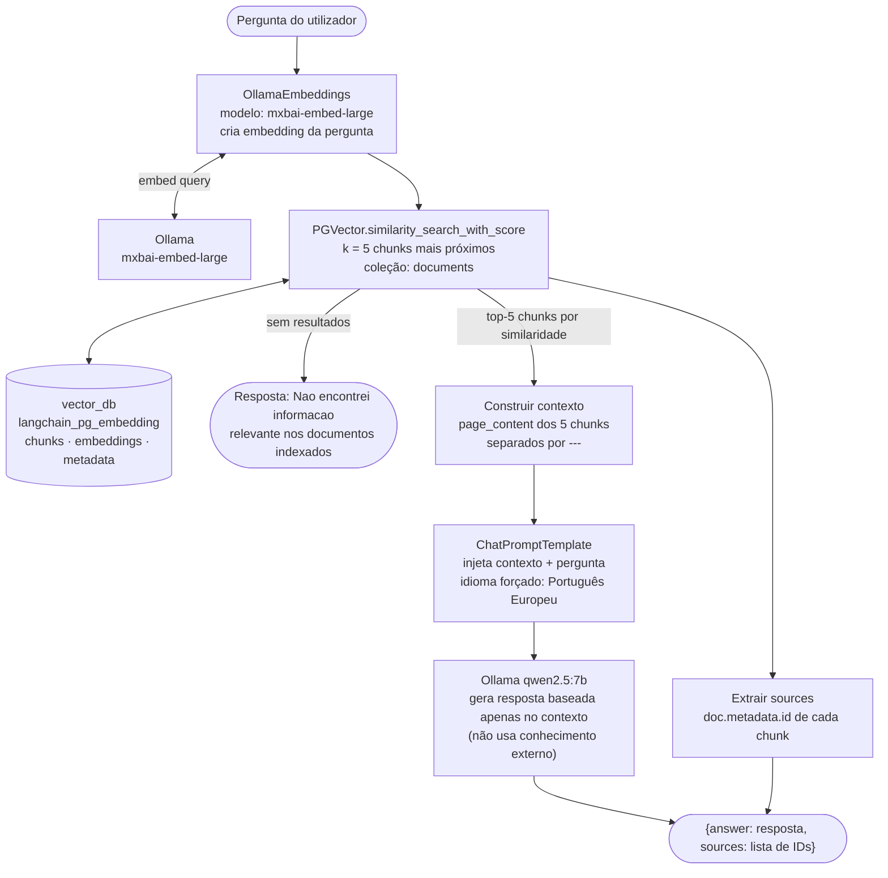

# Chatbot RAG — Fluxo de Dados (chat_reports.py)

```mermaid
flowchart TD
    Q([Pergunta do utilizador]) --> EMB["OllamaEmbeddings\nmodelo: mxbai-embed-large\ncria embedding da pergunta"]

    EMB <-->|"embed query"| OLLE[Ollama\nmxbai-embed-large]

    EMB --> SEARCH["PGVector.similarity_search_with_score\nk = 5 chunks mais próximos\ncoleção: documents"]
    SEARCH <--> VDB[(vector_db\nlangchain_pg_embedding\nchunks · embeddings · metadata)]

    SEARCH -->|"sem resultados"| NORESP([Resposta: Nao encontrei informacao\nrelevante nos documentos indexados])

    SEARCH -->|"top-5 chunks por similaridade"| CTX["Construir contexto\npage_content dos 5 chunks\nseparados por ---"]

    CTX --> PROMPT["ChatPromptTemplate\ninjeta contexto + pergunta\nidioma forçado: Português Europeu"]
    PROMPT --> LLM["Ollama qwen2.5:7b\ngera resposta baseada apenas no contexto\n(não usa conhecimento externo)"]

    SEARCH --> SRC["Extrair sources\ndoc.metadata.id de cada chunk"]

    LLM --> RESP
    SRC --> RESP(["{answer: resposta, sources: lista de IDs}"])
```
