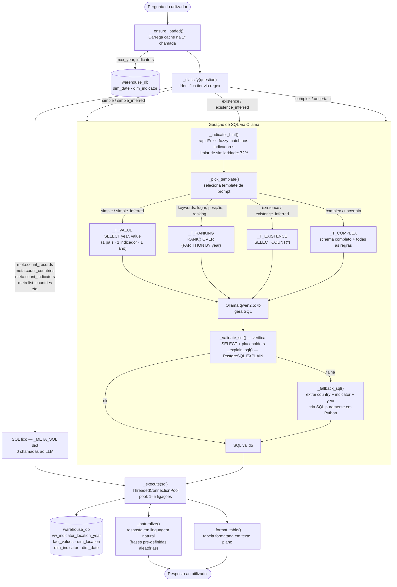

# Chatbot SQL — Fluxo de Dados (chat_data.py)

```mermaid
flowchart TD
    Q([Pergunta do utilizador]) --> LOAD["_ensure_loaded()\nCarrega cache na 1ª chamada"]
    LOAD <-->|"max_year, indicators"| WHCACHE[(warehouse_db\ndim_date · dim_indicator)]
    LOAD --> CLASS

    CLASS["_classify(question)\nIdentifica tier via regex"]

    CLASS -->|"meta:count_records\nmeta:count_countries\nmeta:count_indicators\nmeta:list_countries\netc."| META
    CLASS -->|"simple / simple_inferred"| GEN
    CLASS -->|"existence / existence_inferred"| GEN
    CLASS -->|"complex / uncertain"| GEN

    META["SQL fixo — _META_SQL dict\n0 chamadas ao LLM"]
    META --> EXEC

    subgraph GEN [Geração de SQL via Ollama]
        HINT["_indicator_hint()\nrapidFuzz: fuzzy match nos indicadores\nlimiar de similaridade: 72%"]
        HINT --> PICK["_pick_template()\nseleciona template de prompt"]
        PICK -->|"simple / simple_inferred"| TV["_T_VALUE\nSELECT year, value\n(1 país · 1 indicador · 1 ano)"]
        PICK -->|"keywords: lugar, posição, ranking..."| TR["_T_RANKING\nRANK() OVER (PARTITION BY year)"]
        PICK -->|"existence / existence_inferred"| TE["_T_EXISTENCE\nSELECT COUNT(*)"]
        PICK -->|"complex / uncertain"| TC["_T_COMPLEX\nschema completo + todas as regras"]
        TV & TR & TE & TC --> OLL["Ollama qwen2.5:7b\ngera SQL"]
        OLL --> VAL["_validate_sql() — verifica SELECT + placeholders\n_explain_sql() — PostgreSQL EXPLAIN"]
        VAL -->|ok| SQLOK[SQL válido]
        VAL -->|falha| FALL["_fallback_sql()\nextrai country + indicator + year\ncria SQL puramente em Python"]
        FALL --> SQLOK
    end

    SQLOK --> EXEC
    EXEC["_execute(sql)\nThreadedConnectionPool\npool: 1–5 ligações"]
    EXEC <--> WH[(warehouse_db\nvw_indicator_location_year\nfact_values · dim_location\ndim_indicator · dim_date)]

    EXEC --> NAT["_naturalize()\nresposta em linguagem natural\n(frases pré-definidas aleatórias)"]
    EXEC --> FMT["_format_table()\ntabela formatada em texto plano"]
    NAT & FMT --> RESP([Resposta ao utilizador])
```
