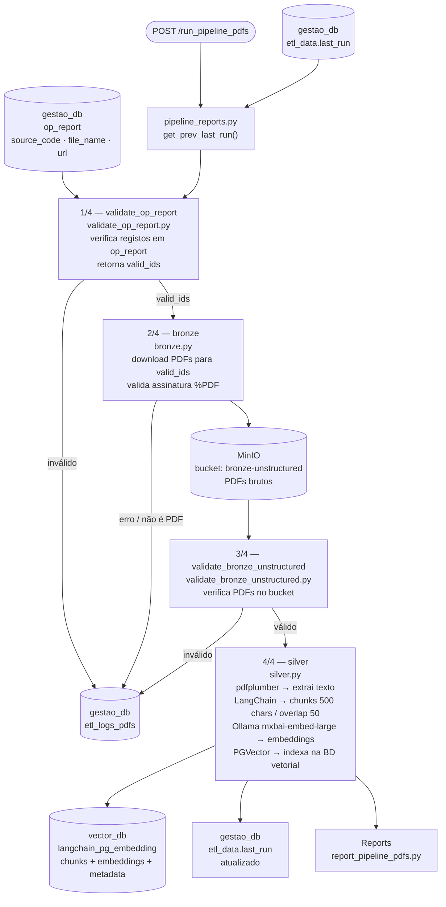

# Pipeline de PDFs — Dados Não Estruturados / RAG Index

```mermaid
flowchart TD
    API([POST /run_pipeline_pdfs]) --> INIT["pipeline_reports.py\nget_prev_last_run()"]

    ETLTS[(gestao_db\netl_data.last_run)] --> INIT
    OPREP[(gestao_db\nop_report\nsource_code · file_name · url)] --> S1
    INIT --> S1

    S1["1/4 — validate_op_report\nvalidate_op_report.py\nverifica registos em op_report\nretorna valid_ids"]
    S1 -->|inválido| LOGS[(gestao_db\netl_logs_pdfs)]
    S1 -->|valid_ids| S2

    S2["2/4 — bronze\nbronze.py\ndownload PDFs para valid_ids\nvalida assinatura %PDF"]
    S2 -->|erro / não é PDF| LOGS
    S2 --> BRON[(MinIO\nbucket: bronze-unstructured\nPDFs brutos)]

    BRON --> S3["3/4 — validate_bronze_unstructured\nvalidate_bronze_unstructured.py\nverifica PDFs no bucket"]
    S3 -->|inválido| LOGS
    S3 -->|válido| S4

    S4["4/4 — silver\nsilver.py\npdfplumber → extrai texto\nLangChain → chunks 500 chars / overlap 50\nOllama mxbai-embed-large → embeddings\nPGVector → indexa na BD vetorial"]
    S4 --> VDB[(vector_db\nlangchain_pg_embedding\nchunks + embeddings + metadata)]

    S4 --> UPD["gestao_db\netl_data.last_run\natualizado"]
    S4 --> RPT["Reports\nreport_pipeline_pdfs.py"]
```
